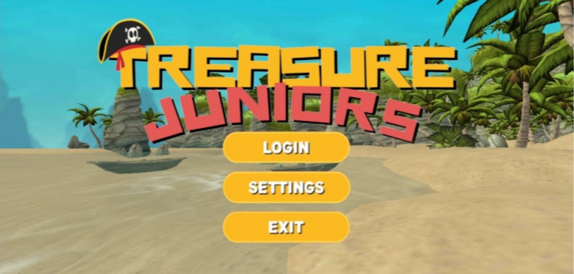
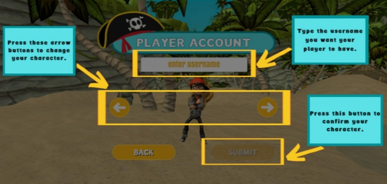
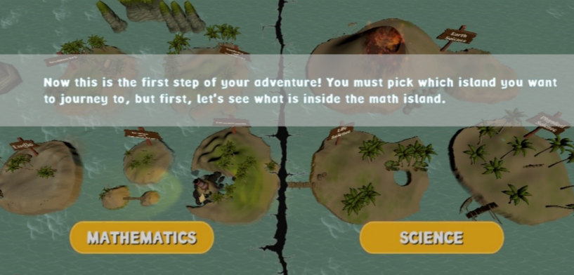
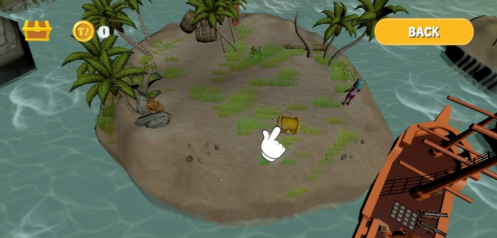
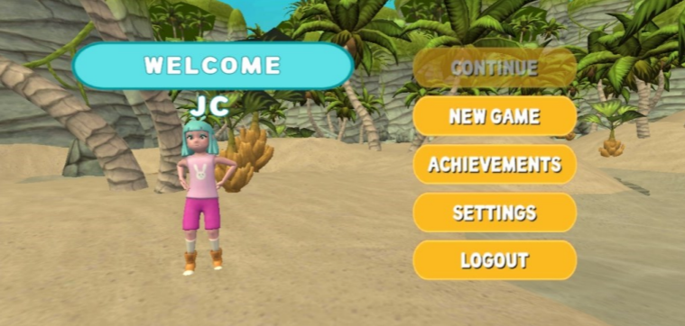

# 🎮 Treasure Juniors: A 3D Adventure and Puzzle Android Game Using Unity

## Project Overview
**Treasure Juniors** is a 3D adventure and puzzle game developed for Android using the **Unity Game Engine**.  
The game combines exploration, puzzle-solving, and interactive gameplay mechanics within a stylized 3D environment.

This project was created as part of an academic game development thesis and follows industry-standard practices for Unity projects and version control.

---

## 🛠️ Technologies Used
- **Game Engine:** Unity  
- **Programming Language:** C#  
- **IDE:** Microsoft Visual Studio  
- **UI Design:** Adobe Illustrator, Canva  
- **3D Assets & Animation:** Mixamo  
- **Version Control:** Git & GitHub  

Some freely available Unity assets were incorporated to support development and prototyping.

---

## 📸 Screenshots

### Gameplay

### Main Menu

*Screenshots shown above are taken from the Android version of the game running on a mobile device.*

---

## 🧠 Game Systems & Implementation

### Gameplay Architecture
The game was developed using Unity’s **component-based architecture**.  
Reusable game objects such as characters, interactable items, and environment elements were implemented using **Unity Prefabs** to ensure consistency, modularity, and efficient development.

> Player data and game states are managed through Unity scripts and built-in serialization systems.

---

### Artificial Intelligence & Pathfinding
Artificial intelligence was implemented to handle movement and navigation for both the playable character and the ship.

Unity’s **NavMesh system** was used to enable pathfinding, allowing controllable entities to:
- Navigate complex environments  
- Avoid obstacles dynamically  
- Travel from a starting position to a destination using the shortest possible path  

Unity utilizes the **A\*** (A-Star) **algorithm** for pathfinding.  
The A* algorithm is widely used in the game development industry due to its efficiency and accuracy.

The algorithm’s performance depends on:
- The **heuristic function**, which estimates the distance between nodes  
- The **complexity of the environment**, where higher complexity may increase processing time or reduce path accuracy  

---

## 📂 Project Structure
This repository contains only the essential Unity project files:
Assets/
Packages/
ProjectSettings/

Build files, temporary folders, large binaries, and sensitive data are excluded using a `.gitignore` file to keep the repository clean and lightweight.

---

## 📱 Playable Build
**Treasure Juniors** is officially available on the **Google Play Store**.

Due to GitHub file size restrictions, the full Android build and large asset files are not included in this repository.

> 🔎 **How to play:**  
> Open the Google Play Store and search for **“Treasure Juniors”**

---

## 👥 Author / Team
This project was developed by **the team** as part of a college thesis requirement, applying both theoretical and practical knowledge in game development, artificial intelligence, and software engineering.

---

## 📌 Notes
- This repository is intended for **academic, learning, and portfolio purposes**
- Some assets used are freely available and belong to their respective creators

